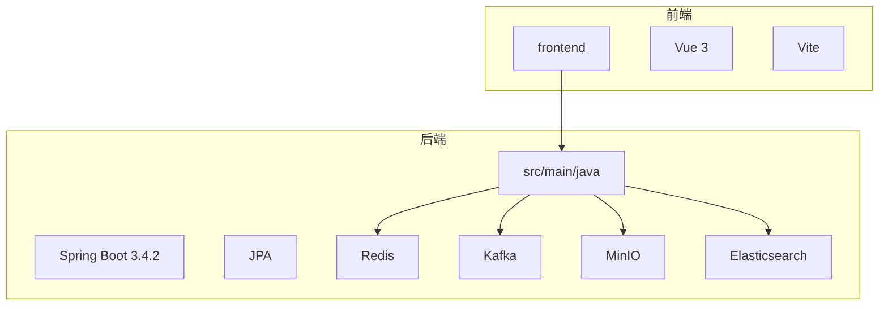
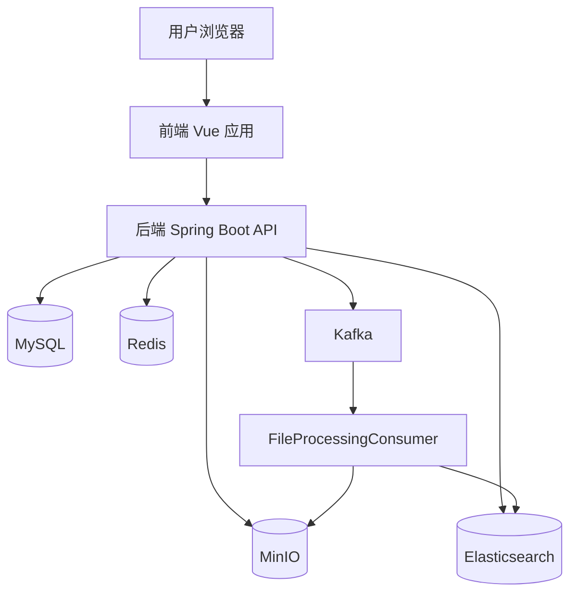
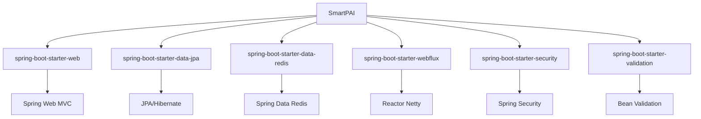

# 监控体系

<cite>
**本文档引用的文件**  
- [application.yml](file://src/main/resources/application.yml)
- [pom.xml](file://pom.xml)
- [WebConfig.java](file://src/main/java/com/yizhaoqi/smartpai/config/WebConfig.java)
- [SecurityConfig.java](file://src/main/java/com/yizhaoqi/smartpai/config/SecurityConfig.java)
- [AdminController.java](file://src/main/java/com/yizhaoqi/smartpai/controller/AdminController.java)
- [SmartPaiApplication.java](file://src/main/java/com/yizhaoqi/smartpai/SmartPaiApplication.java)
</cite>

## 目录
1. [引言](#引言)
2. [项目结构](#项目结构)
3. [核心组件](#核心组件)
4. [架构概览](#架构概览)
5. [详细组件分析](#详细组件分析)
6. [依赖分析](#依赖分析)
7. [性能考量](#性能考量)
8. [故障排查指南](#故障排查指南)
9. [结论](#结论)

## 引言

本项目旨在构建一个基于Spring Boot的智能知识助手系统，具备文档解析、向量检索和AI问答能力。为确保系统的稳定性和可观测性，需建立完善的监控体系。尽管当前代码库中尚未集成Micrometer、Prometheus和Grafana等标准监控组件，但已具备实现监控的基础条件。本文档将基于现有架构，详细说明如何集成Spring Boot Actuator暴露JVM指标、HTTP请求统计、线程池状态和数据库连接池信息，并通过Micrometer实现指标收集，最终构建完整的监控告警体系。

## 项目结构

该项目采用典型的前后端分离架构，后端基于Spring Boot 3.4.2构建，前端使用Vue 3框架。后端项目结构清晰，遵循MVC分层模式，包含controller、service、repository、config等标准包。前端位于`frontend`目录，后端核心代码位于`src/main/java/com/yizhaoqi/smartpai`目录。项目通过Maven进行依赖管理，配置文件主要位于`src/main/resources`目录。



**图示来源**
- [pom.xml](file://pom.xml#L1-L203)
- 项目结构

## 核心组件

项目的核心组件包括：
- **Spring Boot WebFlux**: 用于处理响应式HTTP请求，支持高并发场景。
- **Spring Data JPA**: 用于与MySQL数据库交互，管理实体数据。
- **Spring Data Redis**: 用于与Redis缓存交互，提升数据访问速度。
- **Spring Kafka**: 用于与Kafka消息队列交互，实现异步任务处理。
- **MinIO Client**: 用于与MinIO对象存储交互，管理文件上传下载。
- **Elasticsearch Java Client**: 用于与Elasticsearch搜索引擎交互，实现全文检索。

这些组件共同构成了应用的核心功能，而监控体系的建立将围绕这些组件的运行状态展开。

**本节来源**
- [pom.xml](file://pom.xml#L1-L203)
- [SmartPaiApplication.java](file://src/main/java/com/yizhaoqi/smartpai/SmartPaiApplication.java#L1-L14)

## 架构概览

系统采用微服务架构风格，虽然目前为单体应用，但已具备微服务的特征。前端通过HTTP API与后端通信，后端通过RESTful接口提供服务。系统内部使用Kafka进行异步解耦，文件处理任务通过Kafka消息队列触发。数据存储方面，使用MySQL存储结构化数据，Redis存储缓存和会话，MinIO存储文件，Elasticsearch存储向量和全文索引。



**图示来源**
- [pom.xml](file://pom.xml#L1-L203)
- [KafkaConfig.java](file://src/main/java/com/yizhaoqi/smartpai/config/KafkaConfig.java)
- [FileProcessingConsumer.java](file://src/main/java/com/yizhaoqi/smartpai/consumer/FileProcessingConsumer.java)

## 详细组件分析

### 监控端点分析

目前，项目中已通过`AdminController`类暴露了两个管理员专用的监控端点，用于获取系统状态和用户活动日志。这些端点需要管理员角色（ADMIN）才能访问，体现了基本的安全控制。

#### 系统状态监控端点

`/api/v1/admin/system/status`端点返回模拟的系统状态数据，包括CPU使用率、内存使用率、磁盘使用率、活跃用户数等关键指标。该端点是实现系统健康检查的良好起点。

```java
@GetMapping("/system/status")
public ResponseEntity<?> getSystemStatus(@RequestHeader("Authorization") String token) {
    // ... 认证逻辑
    Map<String, Object> status = new HashMap<>();
    status.put("cpu_usage", "30%");
    status.put("memory_usage", "45%");
    status.put("disk_usage", "60%");
    status.put("active_users", 15);
    status.put("total_documents", 250);
    status.put("total_conversations", 1200);
    return ResponseEntity.ok(Map.of("data", status));
}
```

此端点目前返回的是模拟数据，未来应集成实际的系统监控库来获取真实指标。

#### 用户活动日志端点

`/api/v1/admin/user-activities`端点返回模拟的用户活动日志，包括用户登录、文件上传等操作记录。这对于审计和安全分析至关重要。

```java
@GetMapping("/user-activities")
public ResponseEntity<?> getUserActivities(
        @RequestHeader("Authorization") String token,
        @RequestParam(required = false) String username,
        @RequestParam(required = false) String start_date,
        @RequestParam(required = false) String end_date) {
    // ... 认证逻辑
    List<Map<String, Object>> activities = List.of(
        Map.of(
            "username", "user1",
            "action", "LOGIN",
            "timestamp", "2023-03-01T10:15:30",
            "ip_address", "192.168.1.100"
        ),
        // ... 更多活动
    );
    return ResponseEntity.ok(Map.of("data", activities));
}
```

此端点同样返回模拟数据，未来应连接实际的日志存储系统。

**本节来源**
- [AdminController.java](file://src/main/java/com/yizhaoqi/smartpai/controller/AdminController.java#L129-L191)

### Spring Boot Actuator 集成方案

尽管项目当前未显式集成Spring Boot Actuator，但通过添加依赖和配置，可以轻松实现。Actuator是Spring Boot提供的生产就绪功能模块，能自动暴露大量有用的监控端点。

#### 依赖添加

在`pom.xml`中添加以下依赖：

```xml
<dependency>
    <groupId>org.springframework.boot</groupId>
    <artifactId>spring-boot-starter-actuator</artifactId>
</dependency>
```

#### 配置暴露端点

在`application.yml`中配置需要暴露的端点：

```yaml
management:
  endpoints:
    web:
      exposure:
        include: health,info,metrics,env,beans,conditions,loggers,threaddump,heapdump
  endpoint:
    health:
      show-details: always
```

这将暴露健康检查、应用信息、指标、环境变量、Bean信息、条件评估、日志配置、线程转储和堆转储等关键端点。

#### 安全配置

在`SecurityConfig.java`中，需要为Actuator端点配置适当的安全策略。建议将敏感端点（如`env`、`beans`）限制为管理员访问。

```java
@Bean
public SecurityFilterChain securityFilterChain(HttpSecurity http) throws Exception {
    http
        // ... 其他配置
        .authorizeHttpRequests(authorize -> authorize
            // ... 其他规则
            .requestMatchers("/actuator/health", "/actuator/info").permitAll()
            .requestMatchers("/actuator/**").hasRole("ADMIN")
            // ... 其他规则
        );
    // ... 其他配置
    return http.build();
}
```

### Micrometer 指标收集

Micrometer是Spring Boot Actuator的底层指标收集库，提供与Prometheus、Graphite、Datadog等监控系统的集成。

#### 依赖添加

```xml
<dependency>
    <groupId>io.micrometer</groupId>
    <artifactId>micrometer-registry-prometheus</artifactId>
</dependency>
```

#### 配置Prometheus

在`application.yml`中启用Prometheus端点：

```yaml
management:
  endpoints:
    web:
      exposure:
        include: health,info,metrics,prometheus
```

这将暴露`/actuator/prometheus`端点，Prometheus服务器可以定期抓取该端点以收集指标。

### 关键监控指标定义

应定义以下关键监控指标：

- **API响应时间**: `http.server.requests`指标，用于监控各API的响应延迟。
- **错误率**: 通过`http.server.requests`指标中的`status`标签统计5xx和4xx错误。
- **系统负载**: 通过`system.cpu.usage`和`jvm.memory.used`等指标监控系统资源。
- **数据库连接池**: 通过`jdbc.connections.max`和`jdbc.connections.active`监控数据库连接使用情况。
- **线程池状态**: 通过`executor.pool.core`、`executor.pool.max`和`executor.pool.active`监控线程池。

### Grafana 仪表板配置

Grafana可以从Prometheus数据源读取指标，并创建可视化仪表板。一个典型的仪表板应包含：

- **系统概览**: CPU、内存、磁盘使用率。
- **JVM状态**: 堆内存、非堆内存、GC次数和时间。
- **HTTP请求**: 请求速率、响应时间、错误率。
- **数据库**: 连接数、查询延迟。
- **自定义业务指标**: 如活跃用户数、文档总数。

### 告警规则设置

在Prometheus或Grafana中设置告警规则，例如：

- **请求超时**: 当API的P99响应时间超过1秒时告警。
- **内存溢出风险**: 当JVM老年代使用率持续超过80%时告警。
- **服务不可用**: 当`/actuator/health`端点返回非200状态时告警。

告警可通过邮件、企业微信等方式通知运维人员。

### WebFlux 响应式架构监控

对于WebFlux响应式架构，需特别关注背压机制和事件循环。

- **背压监控**: 监控`reactor.flow`相关的指标，如`reactor.flow.onBackpressureDrop`，以了解数据流中是否有元素被丢弃。
- **事件循环监控**: 监控`reactor.netty.eventLoop.pendingTasks`，以了解Netty事件循环的负载情况。

## 依赖分析

项目依赖关系清晰，核心依赖为Spring Boot及其生态系统组件。通过Maven管理，依赖版本统一。



**图示来源**
- [pom.xml](file://pom.xml#L1-L203)

## 性能考量

当前项目在性能方面有以下考量：
- **文件上传**: 配置了最大文件大小为50MB，整个请求最大为100MB。
- **WebFlux**: 配置了`max-in-memory-size`为16MB，以处理较大的响应。
- **日志级别**: 在开发环境启用DEBUG级别日志，便于调试。

未来应通过监控系统持续观察性能指标，并根据实际情况进行优化。

## 故障排查指南

当系统出现异常时，可按以下步骤排查：

1. **检查健康状态**: 访问`/actuator/health`端点，确认应用基本健康。
2. **查看日志**: 检查应用日志，特别是`com.yizhaoqi.smartpai`包下的日志。
3. **分析指标**: 在Grafana中查看关键指标，如CPU、内存、请求延迟。
4. **检查依赖服务**: 确认MySQL、Redis、Kafka、MinIO、Elasticsearch等外部服务是否正常。
5. **查看线程转储**: 访问`/actuator/threaddump`端点，分析线程状态，排查死锁或阻塞。

**本节来源**
- [LogUtils.java](file://src/main/java/com/yizhaoqi/smartpai/utils/LogUtils.java)
- [AdminController.java](file://src/main/java/com/yizhaoqi/smartpai/controller/AdminController.java#L129-L156)

## 结论

当前项目已具备构建完善监控体系的基础。通过集成Spring Boot Actuator和Micrometer，可以轻松暴露JVM、HTTP、线程池和数据库连接池等关键指标。结合Prometheus进行指标收集，Grafana进行可视化，可以构建一个强大的监控平台。虽然目前项目中缺少这些组件的直接实现，但其架构设计为监控集成提供了良好的支持。建议尽快实施监控方案，以提高系统的可观测性和稳定性。