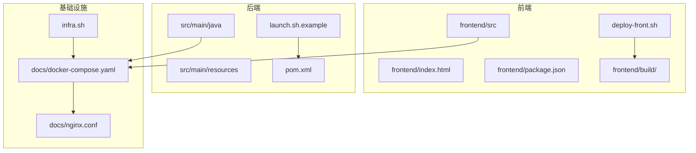
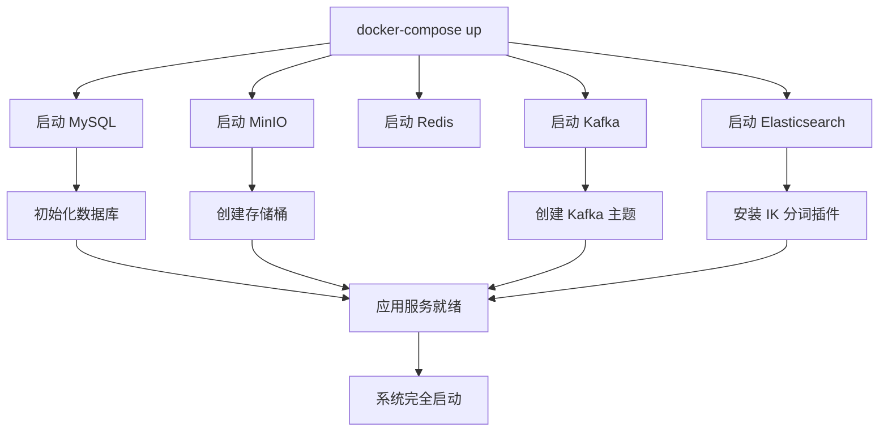
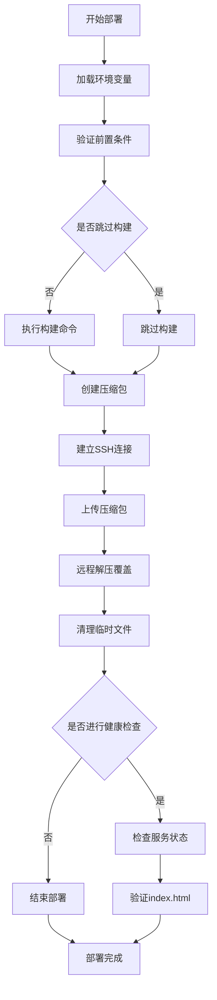
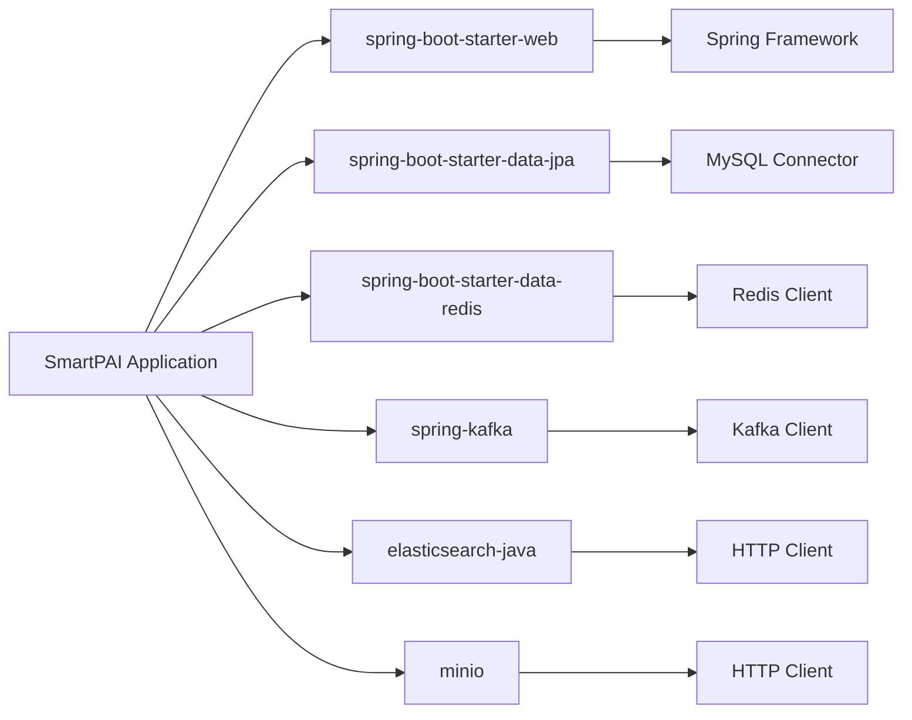

# 部署指南

<cite>
**本文档中引用的文件**   
- [application-docker.yml](file://src/main/resources/application-docker.yml)
- [application-prod.yml](file://src/main/resources/application-prod.yml)
- [application-dev.yml](file://src/main/resources/application-dev.yml)
- [docker-compose.yaml](file://docs/docker-compose.yaml)
- [nginx.conf](file://docs/nginx.conf)
- [logback-spring.xml](file://src/main/resources/logback-spring.xml)
- [pom.xml](file://pom.xml)
- [deploy-front.sh](file://deploy-front.sh)
- [infra.sh](file://infra.sh)
- [launch.sh.example](file://launch.sh.example)
- [frontend/package.json](file://frontend/package.json)
</cite>

## 更新摘要
**变更内容**   
- 新增前端部署自动化脚本deploy-front.sh的功能说明
- 新增本地开发环境管理脚本infra.sh的功能说明
- 新增launch.sh.example后端启动脚本的使用指导
- 更新部署流程以包含完整的前端和后端自动化部署能力
- 新增环境变量配置和部署参数说明
- 完善配置文件体系说明，包括开发、生产、Docker三种配置模式

## 目录
1. [引言](#引言)
2. [项目结构](#项目结构)
3. [核心组件](#核心组件)
4. [架构概述](#架构概述)
5. [详细组件分析](#详细组件分析)
6. [部署自动化脚本](#部署自动化脚本)
7. [配置文件体系](#配置文件体系)
8. [依赖分析](#依赖分析)
9. [性能考虑](#性能考虑)
10. [故障排除指南](#故障排除指南)
11. [结论](#结论)

## 引言
本文档旨在为"派聪明"智能知识库系统提供一份详尽的生产环境部署方案。该系统采用检索增强生成（RAG）技术，集成了MySQL、Elasticsearch、Redis、Kafka、MinIO等多种中间件，以实现文档的智能解析、向量化存储和高效检索。文档将详细介绍单机部署和容器化部署两种模式，涵盖从环境编排、配置管理到性能调优和高可用策略的各个方面，确保系统能够稳定、高效地运行。

**更新** 新增了完整的部署自动化功能，包括前端部署脚本deploy-front.sh、本地开发环境管理脚本infra.sh和后端启动脚本launch.sh.example，提供从开发到生产的完整自动化部署能力。同时完善了配置文件体系，支持开发、生产、Docker三种部署模式。

## 项目结构
项目采用典型的前后端分离架构，后端基于Spring Boot构建，前端基于Vue框架。后端代码位于`src/main/java`目录，核心配置文件（如`application.yml`）位于`src/main/resources`目录。前端代码位于`frontend/src`目录。部署相关的配置文件，如`docker-compose.yaml`和`nginx.conf`，位于`docs`目录下，便于集中管理。



**图源**
- [docker-compose.yaml](file://docs/docker-compose.yaml)
- [nginx.conf](file://docs/nginx.conf)
- [deploy-front.sh](file://deploy-front.sh)
- [infra.sh](file://infra.sh)
- [launch.sh.example](file://launch.sh.example)

**节源**
- [docker-compose.yaml](file://docs/docker-compose.yaml)
- [nginx.conf](file://docs/nginx.conf)
- [deploy-front.sh](file://deploy-front.sh)
- [infra.sh](file://infra.sh)
- [launch.sh.example](file://launch.sh.example)

## 核心组件
系统的核心组件包括：
- **应用服务 (SmartPAI)**：基于Spring Boot的后端服务，处理业务逻辑、API请求和与各中间件的交互。
- **MySQL**：关系型数据库，用于存储用户信息、会话记录等结构化数据。
- **Elasticsearch**：搜索引擎，用于存储和检索文档的向量和文本内容，支持混合搜索。
- **Redis**：内存数据库，用作缓存和会话存储，提升系统响应速度。
- **Kafka**：消息队列，用于解耦文件处理流程，实现异步任务处理。
- **MinIO**：对象存储服务，用于持久化存储用户上传的原始文件。
- **前端应用**：基于Vue 3的单页应用，提供用户界面和交互功能。

**更新** 新增前端应用组件，提供完整的用户界面和交互体验。

**节源**
- [pom.xml](file://pom.xml)
- [application-docker.yml](file://src/main/resources/application-docker.yml)
- [frontend/package.json](file://frontend/package.json)

## 架构概述
系统采用微服务架构思想，通过Docker容器化部署，实现了各组件的隔离与解耦。前端通过Nginx反向代理与后端应用服务通信。应用服务通过JPA与MySQL交互，通过Elasticsearch客户端与Elasticsearch交互，通过Spring Data Redis与Redis交互，通过Spring Kafka与Kafka交互，并通过MinIO SDK与MinIO交互。文件上传后，会通过Kafka发布消息，由独立的消费者进行异步处理。

**更新** 新增前端应用层，通过Nginx反向代理提供静态资源服务。

```mermaid
graph TB
subgraph "客户端"
UI[用户浏览器]
end
subgraph "基础设施"
Nginx[Nginx 反向代理]
End
subgraph "应用层"
Frontend[前端应用]
Backend[后端应用服务]
end
subgraph "数据层"
MySQL[(MySQL)]
ES[(Elasticsearch)]
Redis[(Redis)]
MinIO[(MinIO)]
Kafka[(Kafka)]
end
UI --> Nginx
Nginx --> Frontend
Nginx --> Backend
Frontend --> Backend
Backend --> MySQL
Backend --> ES
Backend --> Redis
Backend --> MinIO
Backend --> Kafka
Kafka --> Backend
```

**图源**
- [application-docker.yml](file://src/main/resources/application-docker.yml)
- [docker-compose.yaml](file://docs/docker-compose.yaml)
- [deploy-front.sh](file://deploy-front.sh)

## 详细组件分析

### 容器化部署编排
`docker-compose.yaml`文件定义了所有服务的容器化部署方案。它使用`docker-compose`工具，可以一键启动整个技术栈。



**图源**
- [docker-compose.yaml](file://docs/docker-compose.yaml)

**节源**
- [docker-compose.yaml](file://docs/docker-compose.yaml)

#### MySQL 服务
MySQL服务配置了数据卷`mysql-data`以实现数据持久化，并通过环境变量`MYSQL_ROOT_PASSWORD`设置root用户密码。其健康检查通过`mysqladmin ping`命令确保数据库完全可用后，才允许依赖它的应用服务启动。

#### MinIO 服务
MinIO服务暴露了两个端口：19000用于API，19001用于Web控制台。它同样使用数据卷`minio-data`进行持久化，并通过`MINIO_ROOT_USER`和`MINIO_ROOT_PASSWORD`设置管理员凭据。启动后，它会自动创建名为`uploads`的存储桶。

#### Redis 服务
Redis服务通过`--requirepass`参数设置了访问密码，并通过`--appendonly yes`开启了AOF持久化模式，以保证数据安全。健康检查使用`redis-cli ping`命令来验证服务的连通性。

#### Kafka 服务
Kafka服务使用了Bitnami的镜像，配置了控制器和代理角色。它通过一个复杂的`command`脚本，在Kafka启动后自动创建两个主题：`file-processing`和`vectorization`，用于处理文件和向量化任务。这确保了生产者和消费者在启动时，所需的主题已经存在。

#### Elasticsearch 服务
Elasticsearch服务配置了2GB的JVM堆内存（`ES_JAVA_OPTS=-Xms2g -Xmx2g`），并使用`es-data`卷进行数据持久化。最关键的配置是其`command`脚本，该脚本在容器启动时会检查并自动安装`analysis-ik`中文分词插件，这对于处理中文文档至关重要。

### 生产环境配置分析
`application-docker.yml`文件包含了应用在生产环境下的所有配置项。

#### 数据库连接池与JPA
```yaml
spring:
  datasource:
    url: jdbc:mysql://localhost:3306/PaiSmart?useSSL=false&serverTimezone=UTC
    username: root
    password: PaiSmart2025
    driver-class-name: com.mysql.cj.jdbc.Driver
  jpa:
    hibernate:
      ddl-auto: update
    show-sql: true
    properties:
      hibernate:
        dialect: org.hibernate.dialect.MySQL8Dialect
```
此配置指定了MySQL数据库的连接URL、用户名和密码。`ddl-auto: update`表示Hibernate会根据实体类自动更新数据库表结构，这在生产环境中需谨慎使用，建议在稳定后改为`none`。日志级别为`DEBUG`，便于调试。

#### 缓存与文件上传
```yaml
spring:
  data:
    redis:
      host: localhost
      port: 6379
      password: PaiSmart2025
  servlet:
    multipart:
      enabled: true
      max-file-size: 50MB
      max-request-size: 100MB
```
应用通过`spring.data.redis`配置连接到Redis。文件上传的最大单文件大小为50MB，整个请求的最大大小为100MB，这满足了大多数文档上传的需求。

#### 消息队列Kafka
```yaml
spring:
  kafka:
    enabled: true
    bootstrap-servers: 127.0.0.1:9092
    consumer:
      group-id: file-processing-group
      auto-offset-reset: earliest
    topic:
      file-processing: file-processing-topic1
```
应用启用了Kafka，并配置了消费者组`file-processing-group`。`auto-offset-reset: earliest`确保在没有初始偏移量或偏移量无效时，从分区的开头开始读取，这对于确保不丢失消息很重要。

#### 对象存储MinIO
```yaml
minio:
  endpoint: http://localhost:19000
  accessKey: aHZtaNPEzLcERm9uCY2F
  secretKey: 5lhyVdLKfMfYXtmdVsulLYpgCRx5EO1EfIWAtJdq
  bucketName: uploads
```
应用通过`endpoint`、`accessKey`和`secretKey`连接到MinIO服务，并指定`uploads`为默认存储桶。

#### 日志级别配置
`logback-spring.xml`文件定义了详细的日志策略。生产环境（`prod` profile）下，核心业务日志级别为`INFO`，而Spring框架和第三方库的日志级别被设置为`WARN`，以减少日志量，避免日志文件过大影响性能。同时，日志被分类输出到不同的文件中，如`business.log`和`performance.log`，便于问题排查。

**节源**
- [application-docker.yml](file://src/main/resources/application-docker.yml)
- [application-prod.yml](file://src/main/resources/application-prod.yml)
- [application-dev.yml](file://src/main/resources/application-dev.yml)
- [logback-spring.xml](file://src/main/resources/logback-spring.xml)

### Nginx反向代理与SSL
`nginx.conf`文件提供了Nginx的反向代理配置示例。

```nginx
server {
  listen 8080;

  location / {
    root html;
    index index.html index.htm;
  }

  location /api/ {
    proxy_pass http://127.0.0.1:8081;
  }

  location /proxy-ws {
    rewrite ^/proxy-ws(/.*)$ $1 break;
    proxy_pass http://127.0.0.1:8081;
    proxy_http_version 1.1;
    proxy_set_header Upgrade $http_upgrade;
    proxy_set_header Connection "upgrade";
  }
}
```
此配置将8080端口的请求代理到前端静态资源，将`/api/`前缀的请求代理到后端应用服务的8081端口。特别地，`/proxy-ws`配置了WebSocket支持，这对于聊天功能至关重要。

**SSL证书部署指导**：
1.  将SSL证书（`.crt`）和私钥（`.key`）文件放置在服务器上的安全目录。
2.  修改Nginx配置，将`listen 8080;`改为`listen 443 ssl;`。
3.  添加SSL配置：
    ```
    ssl_certificate /path/to/your/certificate.crt;
    ssl_certificate_key /path/to/your/private.key;
    ssl_protocols TLSv1.2 TLSv1.3;
    ssl_ciphers HIGH:!aNULL:!MD5;
    ```
4.  重启Nginx服务。

**节源**
- [nginx.conf](file://docs/nginx.conf)

## 部署自动化脚本

### 前端部署脚本 deploy-front.sh
`deploy-front.sh`是一个专门用于前端应用部署的自动化脚本，提供了完整的前端构建、打包、传输和部署流程。

#### 功能特性
- **环境变量支持**：通过`.env`文件支持环境变量配置，包括服务器主机、用户、密钥、目标目录等
- **灵活的构建命令**：支持自定义构建命令，默认使用`pnpm build`
- **远程部署**：自动压缩构建产物并通过SSH传输到远程服务器
- **健康检查**：部署完成后自动进行健康检查，确保服务正常运行
- **安全传输**：使用SSH密钥认证，支持严格主机密钥检查

#### 部署流程


**图源**
- [deploy-front.sh](file://deploy-front.sh)

#### 环境变量配置
脚本支持以下环境变量：
- `DEPLOY_SERVER_HOST`：目标服务器主机地址
- `DEPLOY_SERVER_USER`：SSH用户名，默认为`root`
- `DEPLOY_SERVER_KEY`：SSH密钥文件路径
- `DEPLOY_TARGET_DIR`：远程目标目录，默认为`/home/www/PaiSmart-Front`
- `DEPLOY_BUILD_CMD`：构建命令，默认为`pnpm build`
- `DEPLOY_SKIP_BUILD`：是否跳过构建，1表示跳过
- `DEPLOY_HEALTHCHECK_URL`：健康检查URL，默认为`https://smart.paicoding.com`
- `DEPLOY_HEALTHCHECK_TIMEOUT`：健康检查超时时间，默认为15秒

#### 使用示例
```bash
# 基本部署
./deploy-front.sh

# 指定环境文件
DEPLOY_SERVER_HOST=192.168.1.100 ./deploy-front.sh

# 跳过构建阶段
DEPLOY_SKIP_BUILD=1 ./deploy-front.sh

# 自定义构建命令
DEPLOY_BUILD_CMD="pnpm build --mode production" ./deploy-front.sh
```

**节源**
- [deploy-front.sh](file://deploy-front.sh)

### 本地开发环境管理脚本 infra.sh
`infra.sh`是一个强大的本地开发环境管理脚本，提供了对MinIO、Kafka和Elasticsearch等开发依赖的统一管理。

#### 支持的服务
- **MinIO**：对象存储服务，提供S3兼容的API
- **Kafka**：分布式流处理平台，用于消息队列
- **Elasticsearch**：搜索引擎，用于文档检索

#### 核心功能
- **服务启动/停止**：支持单个或多个服务的启动和停止
- **健康检查**：自动检测服务状态和端口监听情况
- **日志管理**：实时查看服务日志
- **状态监控**：显示服务运行状态、PID和端口信息
- **URL展示**：一键查看各服务的访问地址

#### 服务管理命令
```bash
# 启动所有服务
./infra.sh start

# 启动特定服务
./infra.sh start minio kafka

# 停止服务
./infra.sh stop elasticsearch

# 查看服务状态
./infra.sh status

# 查看服务日志
./infra.sh logs kafka

# 查看服务URL
./infra.sh urls
```

#### 健康检查机制
脚本内置了针对各服务的健康检查逻辑：
- **MinIO**：检查API和控制台端点的健康状态
- **Kafka**：验证端口监听状态
- **Elasticsearch**：支持HTTP和HTTPS协议的健康检查

#### 日志管理
脚本会将各服务的日志输出到`.runtime/logs/`目录下的独立文件中，便于问题排查和监控。

**节源**
- [infra.sh](file://infra.sh)

### 后端启动脚本 launch.sh.example
`launch.sh.example`提供了后端应用的标准启动流程，支持多种部署模式和环境配置。

#### 功能特性
- **环境变量加载**：支持从`.env`文件加载配置
- **自动编译**：支持从源码直接编译启动
- **进程管理**：提供启动、重启、停止、状态查询功能
- **日志查看**：支持实时查看应用日志
- **JVM参数配置**：支持自定义JVM内存参数

#### 启动流程
```bash
# 从源码编译并启动
./launch.sh start

# 重启已编译的应用
./launch.sh restart

# 查看应用状态
./launch.sh status

# 查看应用日志
./launch.sh logs
```

#### 环境配置
脚本支持以下环境变量：
- `SPRING_PROFILES_ACTIVE`：Spring配置文件激活
- `JAVA_XMS`：JVM最小堆内存
- `JAVA_XMX`：JVM最大堆内存
- `JAVA_XMN`：JVM新生代内存

#### 使用示例
```bash
# 使用生产环境配置启动
./launch.sh start -e .env.prod

# 查看应用进程信息
./launch.sh status

# 实时查看日志
./launch.sh logs
```

**节源**
- [launch.sh.example](file://launch.sh.example)

## 配置文件体系

### 开发环境配置 (application-dev.yml)
开发环境配置文件提供了本地开发时的完整配置，包括数据库连接、缓存设置、Kafka配置、MinIO配置等。该配置文件支持通过环境变量覆盖默认值，便于在不同开发环境中灵活配置。

#### 关键配置项
- **数据库配置**：支持MySQL连接，包含URL、用户名、密码和方言设置
- **缓存配置**：Redis连接配置，支持密码认证
- **文件上传**：最大文件大小和请求大小限制
- **Kafka配置**：生产者和消费者配置，支持事务和幂等性
- **Elasticsearch配置**：支持HTTP和HTTPS协议，允许自签名证书
- **日志配置**：详细的日志级别设置，支持开发调试

### 生产环境配置 (application-prod.yml)
生产环境配置文件针对生产环境进行了优化，包括更严格的日志级别、禁用调试功能、安全配置等。

#### 关键配置项
- **日志级别**：Spring框架和应用日志级别降级为INFO
- **安全配置**：禁用管理员引导功能，启用严格的安全设置
- **Elasticsearch**：禁用自签名证书信任，要求安全连接
- **注册模式**：默认邀请码注册模式，限制外部注册

### Docker环境配置 (application-docker.yml)
Docker环境配置文件专为容器化部署设计，支持通过环境变量动态配置所有连接参数。

#### 关键配置项
- **环境变量支持**：所有连接参数都支持通过环境变量覆盖
- **容器网络**：支持容器间服务发现和连接
- **安全配置**：支持生产级别的安全设置
- **性能优化**：针对容器环境的性能调优参数

**节源**
- [application-docker.yml](file://src/main/resources/application-docker.yml)
- [application-prod.yml](file://src/main/resources/application-prod.yml)
- [application-dev.yml](file://src/main/resources/application-dev.yml)

## 依赖分析
项目的依赖关系通过`pom.xml`文件管理。分析表明，项目直接依赖了`spring-boot-starter-web`、`spring-boot-starter-data-jpa`、`spring-boot-starter-data-redis`、`spring-kafka`、`elasticsearch-java`客户端和`minio` SDK等核心库。值得注意的是，项目**并未**包含`micrometer-registry-prometheus`等Prometheus监控依赖，因此原生不支持Prometheus监控。若需集成，需手动添加相关依赖和配置。



**图源**
- [pom.xml](file://pom.xml)

**节源**
- [pom.xml](file://pom.xml)

## 性能考虑

### JVM参数调优
虽然`application-docker.yml`中未直接配置JVM参数，但`docker-compose.yaml`中为Elasticsearch配置了`ES_JAVA_OPTS=-Xms2g -Xmx2g`。对于应用服务本身，建议在启动时通过`-Xms`和`-Xmx`参数设置合适的堆内存大小（例如`-Xms512m -Xmx2g`），以避免频繁的GC。同时，可以添加`-XX:+UseG1GC`启用G1垃圾回收器，以获得更好的性能。

### Elasticsearch分片设置
当前配置中，Elasticsearch的索引初始化逻辑在`EsIndexInitializer.java`中，但具体的分片（shard）和副本（replica）数量未在配置文件中明确指定，可能使用了默认值（通常是1个主分片和1个副本）。对于生产环境，应根据数据量和查询负载进行调整。例如，对于中等规模的数据，可以设置`number_of_shards: 3`和`number_of_replicas: 1`，以提高查询的并行度和容错性。

### 监控方案
如前所述，项目缺少原生的Prometheus集成。建议的监控方案是：
1.  **添加依赖**：在`pom.xml`中加入`micrometer-registry-prometheus`。
2.  **暴露端点**：配置Spring Boot Actuator，暴露`/actuator/prometheus`端点。
3.  **部署Prometheus**：在`docker-compose.yaml`中添加Prometheus服务，配置其抓取应用的`/actuator/prometheus`端点。
4.  **部署Grafana**：添加Grafana服务，连接Prometheus作为数据源，并导入或创建监控仪表盘，以可视化JVM内存、GC、HTTP请求、Kafka消费者延迟等关键指标。

## 故障排除指南
- **服务无法启动**：检查`docker-compose logs <service_name>`查看具体错误日志。常见问题包括端口冲突、密码错误或数据卷权限问题。
- **Elasticsearch分词插件未安装**：检查`es`容器的日志，确认`analysis-ik`插件安装脚本是否成功执行。
- **Kafka主题未创建**：检查`kafka`容器的日志，确认脚本中的`kafka-topics.sh --create`命令是否成功运行。
- **文件上传失败**：检查MinIO服务是否正常，以及`application-docker.yml`中的MinIO配置是否正确。
- **日志级别过高**：如果生产环境日志过多，确保`logback-spring.xml`中的`<springProfile name="prod">`生效，并将`com.yizhaoqi.smartpai`包的日志级别设置为`INFO`或`WARN`。
- **前端部署失败**：检查`deploy-front.sh`脚本的环境变量配置，确认SSH密钥文件路径和服务器连接信息正确。
- **本地服务启动失败**：使用`infra.sh`脚本的`logs`命令查看具体错误日志，检查各服务的依赖和端口占用情况。

**节源**
- [docker-compose.yaml](file://docs/docker-compose.yaml)
- [logback-spring.xml](file://src/main/resources/logback-spring.xml)
- [deploy-front.sh](file://deploy-front.sh)
- [infra.sh](file://infra.sh)

## 结论
本文档提供了一套完整的"派聪明"系统生产环境部署方案。通过`docker-compose.yaml`可以轻松实现容器化部署，`application-docker.yml`和`nginx.conf`提供了关键的生产配置和反向代理设置。新增的部署自动化脚本进一步提升了部署效率和可靠性。

**更新** 新增的`deploy-front.sh`、`infra.sh`和`launch.sh.example`脚本提供了完整的自动化部署能力：
- **前端部署**：通过`deploy-front.sh`实现前端应用的自动化构建、打包和部署
- **本地开发**：通过`infra.sh`统一管理MinIO、Kafka、Elasticsearch等开发依赖
- **后端启动**：通过`launch.sh.example`提供标准的后端应用启动和管理流程

为了实现系统高可用性和零停机升级，建议采用**滚动更新**策略：准备两套完全相同的生产环境（例如`prod-a`和`prod-b`），通过负载均衡器（如Nginx）将流量导向其中一套。更新时，先将新版本部署到空闲的那套环境，测试通过后，将负载均衡器的流量切换过去。此方案简单有效，无需复杂的蓝绿部署基础设施。未来，通过集成Prometheus和Grafana，可以构建更完善的监控告警体系。

**更新** 通过这些自动化脚本，开发者可以从繁琐的手工部署工作中解放出来，专注于业务逻辑的实现和优化，大大提高了开发效率和部署质量。

**更新** 完善的配置文件体系支持开发、生产、Docker三种部署模式，通过环境变量实现灵活的配置管理，确保系统在不同环境下都能稳定运行。