# 技术面试文档

<cite>
**本文档引用的文件**
- [README.md](file://README.md)
- [paismart.md](file://docs/paismart.md)
- [SmartPaiApplication.java](file://src/main/java/com/yizhaoqi/smartpai/SmartPaiApplication.java)
- [pom.xml](file://pom.xml)
- [AuthController.java](file://src/main/java/com/yizhaoqi/smartpai/controller/AuthController.java)
- [ChatHandler.java](file://src/main/java/com/yizhaoqi/smartpai/service/ChatHandler.java)
- [DocumentService.java](file://src/main/java/com/yizhaoqi/smartpai/service/DocumentService.java)
- [HybridSearchService.java](file://src/main/java/com/yizhaoqi/smartpai/service/HybridSearchService.java)
- [User.java](file://src/main/java/com/yizhaoqi/smartpai/model/User.java)
- [UserRepository.java](file://src/main/java/com/yizhaoqi/smartpai/repository/UserRepository.java)
- [WebSocketConfig.java](file://src/main/java/com/yizhaoqi/smartpai/config/WebSocketConfig.java)
- [main.ts](file://frontend/src/main.ts)
- [index.ts](file://frontend/src/store/modules/auth/index.ts)
- [auth.ts](file://frontend/src/hooks/business/auth.ts)
- [auth.ts](file://frontend/src/service/api/auth.ts)
- [index.vue](file://frontend/src/views/chat/index.vue)
</cite>

## 目录
1. [项目概述](#项目概述)
2. [技术架构](#技术架构)
3. [核心组件分析](#核心组件分析)
4. [RAG系统详解](#rag系统详解)
5. [认证授权机制](#认证授权机制)
6. [实时聊天系统](#实时聊天系统)
7. [文档管理模块](#文档管理模块)
8. [性能优化策略](#性能优化策略)
9. [面试常见问题](#面试常见问题)
10. [最佳实践建议](#最佳实践建议)

## 项目概述

派聪明（PaiSmart）是一个基于检索增强生成（RAG）技术的企业级AI知识库管理系统。该项目采用现代化的全栈技术栈，实现了完整的AI知识库解决方案，包括文档上传、智能解析、向量化存储、混合检索和实时聊天等功能。

### 核心特性

- **企业级RAG架构**：基于Elasticsearch + 向量数据库的混合检索系统
- **多租户权限管理**：支持组织标签层级权限控制
- **实时AI聊天**：基于WebSocket的流式响应聊天系统
- **文档智能处理**：支持多种格式文档的自动解析和向量化
- **分布式架构**：采用微服务化的模块设计

**章节来源**
- [README.md:106-141](file://README.md#L106-L141)
- [paismart.md:195-224](file://docs/paismart.md#L195-L224)

## 技术架构

### 后端技术栈

项目采用Spring Boot 3.4.2 + Java 17的现代化后端架构：

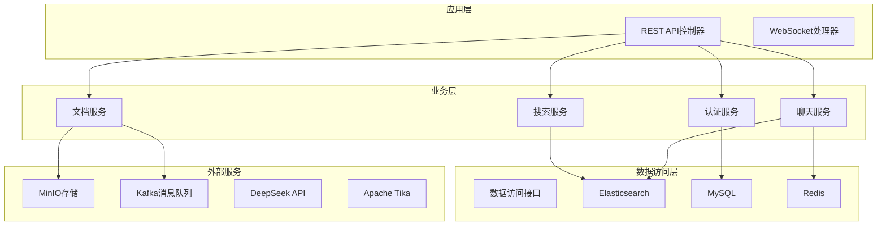

**图表来源**
- [pom.xml:33-187](file://pom.xml#L33-L187)
- [SmartPaiApplication.java:6-11](file://src/main/java/com/yizhaoqi/smartpai/SmartPaiApplication.java#L6-L11)

### 前端技术栈

前端采用Vue 3 + TypeScript + Vite的现代化前端架构：

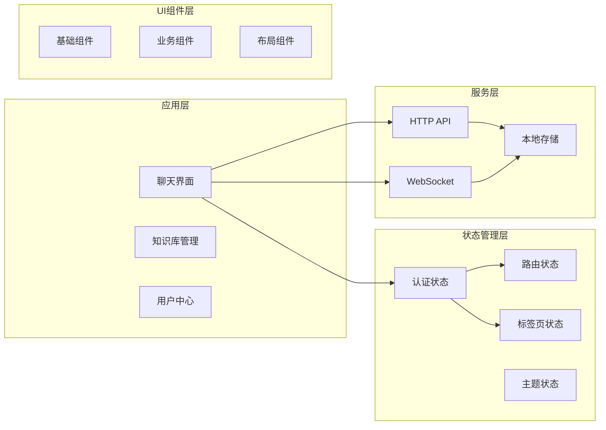

**图表来源**
- [main.ts:9-31](file://frontend/src/main.ts#L9-L31)
- [index.ts:14-208](file://frontend/src/store/modules/auth/index.ts#L14-L208)

**章节来源**
- [README.md:68-127](file://README.md#L68-L127)
- [paismart.md:67-127](file://docs/paismart.md#L67-L127)

## 核心组件分析

### 应用入口与配置

应用程序采用标准的Spring Boot入口点，配置了完整的依赖注入和自动配置：

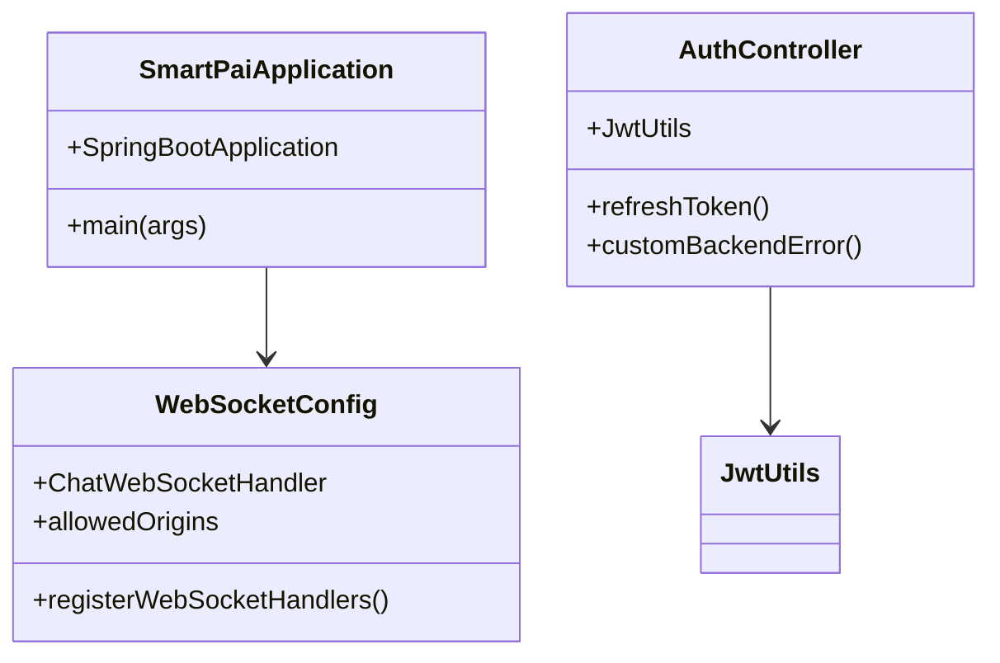

**图表来源**
- [SmartPaiApplication.java:6-11](file://src/main/java/com/yizhaoqi/smartpai/SmartPaiApplication.java#L6-L11)
- [WebSocketConfig.java:14-33](file://src/main/java/com/yizhaoqi/smartpai/config/WebSocketConfig.java#L14-L33)
- [AuthController.java:13-83](file://src/main/java/com/yizhaoqi/smartpai/controller/AuthController.java#L13-L83)

### 数据模型设计

系统采用清晰的数据模型设计，支持多租户权限管理：

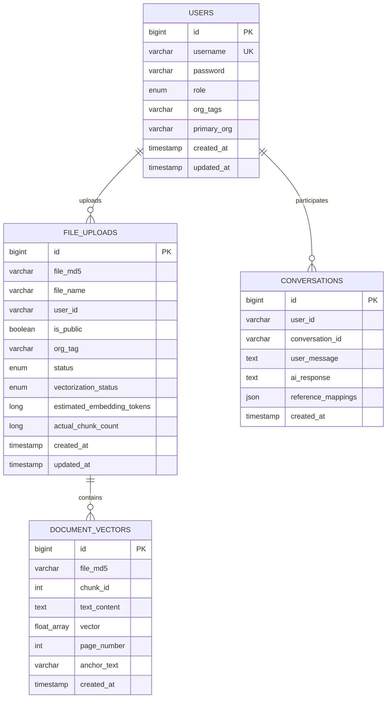

**图表来源**
- [User.java:10-43](file://src/main/java/com/yizhaoqi/smartpai/model/User.java#L10-L43)
- [UserRepository.java:8-10](file://src/main/java/com/yizhaoqi/smartpai/repository/UserRepository.java#L8-L10)

**章节来源**
- [User.java:10-43](file://src/main/java/com/yizhaoqi/smartpai/model/User.java#L10-L43)
- [UserRepository.java:8-10](file://src/main/java/com/yizhaoqi/smartpai/repository/UserRepository.java#L8-L10)

## RAG系统详解

### 混合检索架构

派聪明实现了完整的RAG（检索增强生成）系统，结合了语义向量检索和关键词检索的优势：

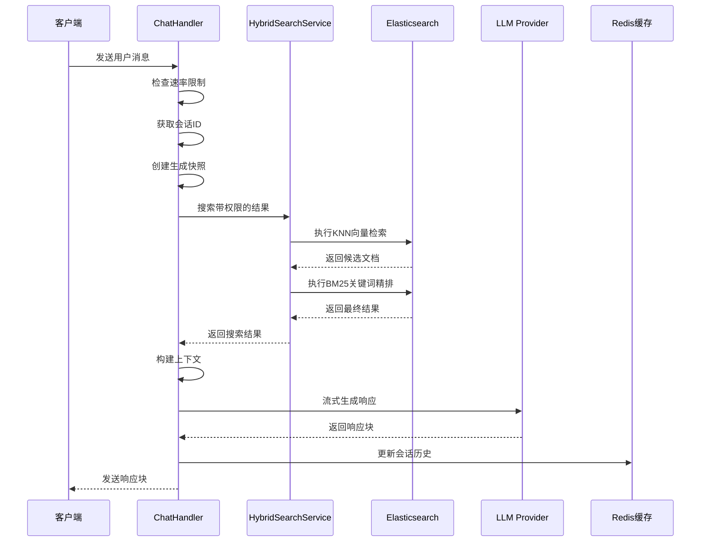

**图表来源**
- [ChatHandler.java:84-160](file://src/main/java/com/yizhaoqi/smartpai/service/ChatHandler.java#L84-L160)
- [HybridSearchService.java:63-177](file://src/main/java/com/yizhaoqi/smartpai/service/HybridSearchService.java#L63-L177)

### 向量化处理流程

系统实现了完整的文档向量化处理管道：

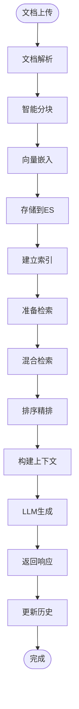

**图表来源**
- [DocumentService.java:171-251](file://src/main/java/com/yizhaoqi/smartpai/service/DocumentService.java#L171-L251)
- [HybridSearchService.java:86-135](file://src/main/java/com/yizhaoqi/smartpai/service/HybridSearchService.java#L86-L135)

**章节来源**
- [HybridSearchService.java:27-53](file://src/main/java/com/yizhaoqi/smartpai/service/HybridSearchService.java#L27-L53)
- [DocumentService.java:43-92](file://src/main/java/com/yizhaoqi/smartpai/service/DocumentService.java#L43-L92)

## 认证授权机制

### JWT认证流程

系统采用JWT + Spring Security的认证授权机制，支持多租户权限管理：

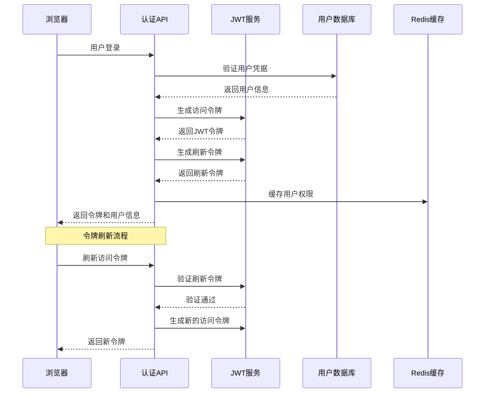

**图表来源**
- [AuthController.java:24-74](file://src/main/java/com/yizhaoqi/smartpai/controller/AuthController.java#L24-L74)
- [index.ts:103-154](file://frontend/src/store/modules/auth/index.ts#L103-L154)

### 多租户权限控制

系统实现了三层权限控制机制：

1. **私人空间权限**：以"PRIVATE_"前缀标识的组织标签，仅资源创建者可访问
2. **组织权限**：同一组织标签下的用户可共享资源
3. **公开权限**：标记为公开的资源所有用户都能访问

**章节来源**
- [AuthController.java:13-83](file://src/main/java/com/yizhaoqi/smartpai/controller/AuthController.java#L13-L83)
- [index.ts:14-208](file://frontend/src/store/modules/auth/index.ts#L14-L208)

## 实时聊天系统

### WebSocket架构

系统采用WebSocket实现实时聊天功能，支持流式响应和多轮对话：

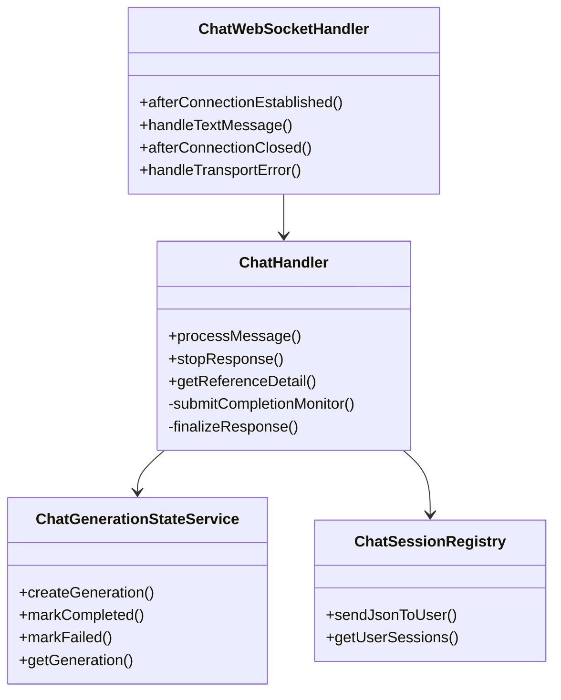

**图表来源**
- [WebSocketConfig.java:14-33](file://src/main/java/com/yizhaoqi/smartpai/config/WebSocketConfig.java#L14-L33)
- [ChatHandler.java:34-82](file://src/main/java/com/yizhaoqi/smartpai/service/ChatHandler.java#L34-L82)

### 聊天流程管理

系统实现了完整的聊天生命周期管理：

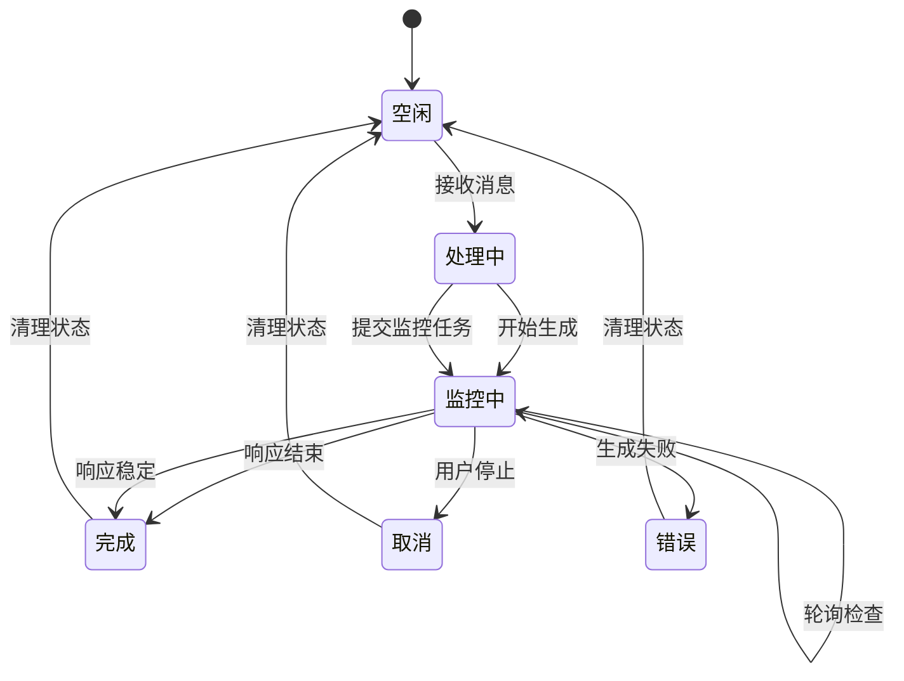

**图表来源**
- [ChatHandler.java:162-230](file://src/main/java/com/yizhaoqi/smartpai/service/ChatHandler.java#L162-L230)
- [ChatHandler.java:232-247](file://src/main/java/com/yizhaoqi/smartpai/service/ChatHandler.java#L232-L247)

**章节来源**
- [ChatHandler.java:84-160](file://src/main/java/com/yizhaoqi/smartpai/service/ChatHandler.java#L84-L160)
- [WebSocketConfig.java:24-32](file://src/main/java/com/yizhaoqi/smartpai/config/WebSocketConfig.java#L24-L32)

## 文档管理模块

### 文件上传与处理

系统实现了完整的文档上传和处理流程，支持断点续传和分片上传：

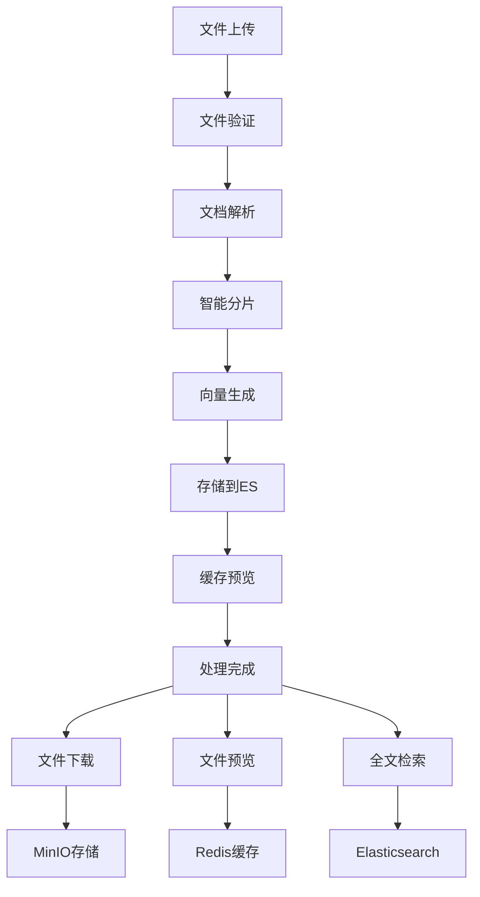

**图表来源**
- [DocumentService.java:103-169](file://src/main/java/com/yizhaoqi/smartpai/service/DocumentService.java#L103-L169)
- [DocumentService.java:469-517](file://src/main/java/com/yizhaoqi/smartpai/service/DocumentService.java#L469-L517)

### PDF预览优化

系统实现了高效的PDF单页预览功能，采用多级缓存策略：

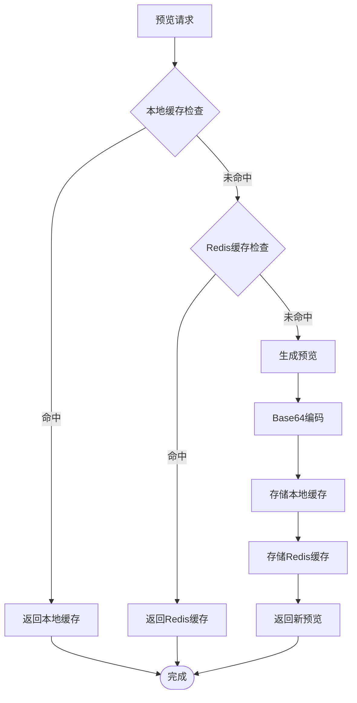

**图表来源**
- [DocumentService.java:585-632](file://src/main/java/com/yizhaoqi/smartpai/service/DocumentService.java#L585-L632)
- [DocumentService.java:688-732](file://src/main/java/com/yizhaoqi/smartpai/service/DocumentService.java#L688-L732)

**章节来源**
- [DocumentService.java:342-400](file://src/main/java/com/yizhaoqi/smartpai/service/DocumentService.java#L342-L400)
- [DocumentService.java:585-777](file://src/main/java/com/yizhaoqi/smartpai/service/DocumentService.java#L585-L777)

## 性能优化策略

### 缓存策略

系统采用了多层次的缓存策略来提升性能：

1. **本地缓存**：针对PDF单页预览的内存缓存
2. **Redis缓存**：存储会话历史和文件预览内容
3. **Elasticsearch缓存**：利用倒排索引的查询缓存

### 异步处理

通过Kafka实现异步任务处理，包括：

- 文档向量化处理
- 文件解析任务
- 统计数据计算

### 连接池优化

系统配置了合理的连接池参数：

- **数据库连接池**：最大连接数、空闲连接数、连接超时
- **Redis连接池**：连接池大小、超时时间
- **HTTP客户端连接池**：连接复用、超时配置

## 面试常见问题

### 后端技术问题

**Q: 如何实现RAG系统的混合检索？**
A: 系统采用Elasticsearch的KNN向量检索结合BM25关键词检索，通过向量相似度和关键词匹配的组合实现更精准的检索结果。

**Q: 如何处理大规模文档的向量化？**
A: 采用分批处理、异步队列和增量更新的策略，支持大规模文档的批量向量化处理。

**Q: 如何实现多租户权限控制？**
A: 通过组织标签层级权限控制，支持私人空间、组织共享和公开访问三种权限模式。

### 前端技术问题

**Q: 如何实现WebSocket的实时聊天？**
A: 使用Vue 3的Composition API和Pinia状态管理，结合WebSocket实现流式响应和实时消息传递。

**Q: 如何处理大文件的上传？**
A: 采用分片上传和断点续传机制，支持进度显示和错误重试。

**Q: 如何优化前端性能？**
A: 通过代码分割、懒加载、缓存策略和虚拟滚动等技术优化前端性能。

### 架构设计问题

**Q: 如何设计可扩展的微服务架构？**
A: 采用模块化设计，每个功能模块独立部署，通过API网关统一管理，支持水平扩展。

**Q: 如何保证系统的高可用性？**
A: 通过负载均衡、熔断器模式、降级策略和监控告警实现系统的高可用性。

## 最佳实践建议

### 代码质量

1. **遵循单一职责原则**：每个类和方法只负责一个功能
2. **使用接口抽象**：通过接口实现松耦合的设计
3. **异常处理**：完善的异常处理和错误恢复机制
4. **日志记录**：详细的日志记录便于问题排查

### 性能优化

1. **数据库优化**：合理的索引设计和查询优化
2. **缓存策略**：多级缓存和缓存失效策略
3. **异步处理**：耗时操作异步化处理
4. **连接池配置**：合理配置连接池参数

### 安全考虑

1. **输入验证**：严格的输入验证和参数校验
2. **权限控制**：基于角色的权限控制机制
3. **数据加密**：敏感数据的加密存储和传输
4. **安全审计**：完整的操作日志和安全审计

### 监控运维

1. **指标监控**：关键业务指标的实时监控
2. **日志聚合**：统一的日志收集和分析
3. **告警机制**：及时的异常告警和通知
4. **性能分析**：定期的性能分析和优化